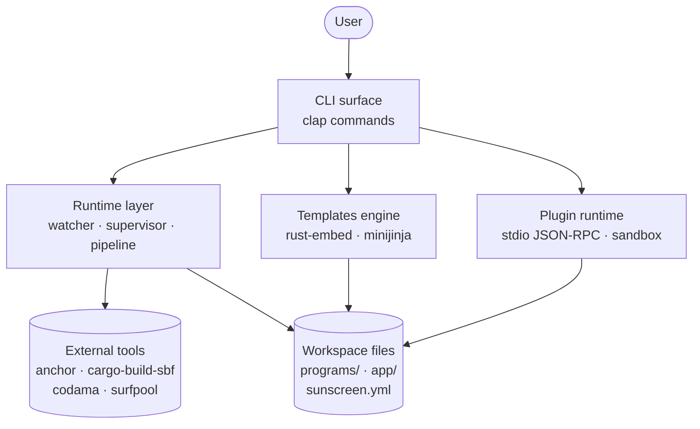

# Architecture

Sunscreen is organized in four layers. Each one has a single responsibility and a clean interface to the next.

## Layer 1 — CLI surface

[`src/cli/`](https://github.com/Pantani/sunscreen/tree/main/src/cli). One module per top-level command (`chain.rs`, `scaffold.rs`, `generate.rs`, `app.rs`, `onboarding/`). Argument parsing via [`clap`](https://docs.rs/clap), exit codes from a single [`error.rs`](https://github.com/Pantani/sunscreen/blob/main/src/error.rs).

The CLI layer is thin: it parses, validates, then hands off to the runtime or templates layers.

## Layer 2 — Runtime

[`src/runtime/`](https://github.com/Pantani/sunscreen/tree/main/src/runtime). Owns:

- **Subprocess management** (`subprocess.rs`) — `CommandSpec`, `ProcessRunner`, `SubprocessRunner`. Every shell-out goes through this for testability.
- **Build pipeline** (`pipeline.rs`) — anchor build → IDL export → Codama → frontend notify.
- **Watcher** (`watcher.rs`) — `notify` events, debounced, dedup'd, filtered.
- **Validator adapters** (`surfpool.rs`, `testvalidator.rs`) — abstracted behind a `LocalValidator` trait.
- **Supervisor** (`supervisor.rs`, `serve.rs`) — long-running orchestrator for `chain serve`.

The runtime never reads CLI args directly. It receives configured `*Spec` structs.

## Layer 3 — Templates

[`src/templates/`](https://github.com/Pantani/sunscreen/tree/main/src/templates) + [`templates/`](https://github.com/Pantani/sunscreen/tree/main/templates) (embedded via `rust-embed`).

Two responsibilities:

- **Scaffold workspaces and primitives** with deterministic [`minijinja`](https://docs.rs/minijinja) rendering. Golden-tested.
- **Patch existing files** through [`src/rustpatch/`](https://github.com/Pantani/sunscreen/tree/main/src/rustpatch) — the marker engine. Line-based, AST-free, resilient to malformed input.

## Layer 4 — Plugin runtime

[`src/plugin/`](https://github.com/Pantani/sunscreen/tree/main/src/plugin). Discovers plugins from `sunscreen.yml`, validates manifests, opens a stdio JSON-RPC session, enforces the sandbox, and routes `scaffold <noun>` commands when a plugin claims a noun.

The gRPC contract in `proto/plugin.proto` is wire-defined but not yet end-to-end live.

## Cross-cutting

| Concern | Where |
|---------|-------|
| Config (`sunscreen.yml`) | [`src/config/`](https://github.com/Pantani/sunscreen/tree/main/src/config) — schema, loader, migrations |
| Toolchain detection | [`src/toolchain/`](https://github.com/Pantani/sunscreen/tree/main/src/toolchain) — uniform `ToolReport` for every external tool |
| Errors | [`src/error.rs`](https://github.com/Pantani/sunscreen/blob/main/src/error.rs) — single `Error` enum, `code` + `next_step` |
| TUI (chain serve) | [`src/tui/serve_model.rs`](https://github.com/Pantani/sunscreen/blob/main/src/tui/serve_model.rs) |

## Design principles

1. **Determinism**. Same inputs → same outputs. Golden tests cover scaffolds; round-trip tests cover marker patches.
2. **Boundary isolation**. Every subprocess call goes through the runner; every file write is in the templates layer or the marker engine. Easy to mock for tests.
3. **Two-layer plugin model**. JSON-RPC over stdio is the floor; gRPC is the ceiling. Both share the same logical contract.
4. **CLI is the API**. `--json` output is part of stability. Editor integrations don't need an SDK.

## See also

- [Build pipeline](./build-pipeline.md) — what runs in what order.
- [Incremental scaffolding](./incremental-scaffolding.md) — markers in depth.
- [Plugin runtime](./plugin-runtime.md) — sandbox and trust.
