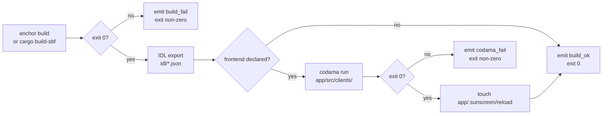
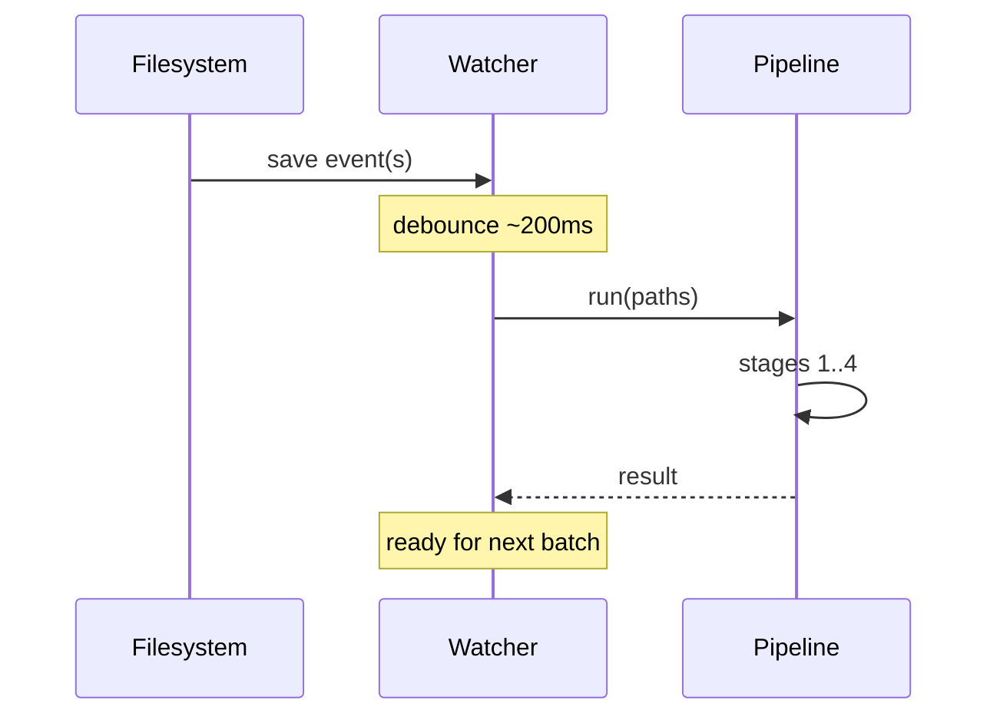

# Build pipeline

`sunscreen chain build` (and the build phase of `chain serve`) runs a deterministic pipeline of stages. Each stage is gated on the previous one's success.

## Stages



## Stage 1 — Compile

- **Anchor workspaces**: `anchor build`. Produces `target/idl/<program>.json` and `target/deploy/<program>.so` per program.
- **Pinocchio workspaces**: `cargo build-sbf`. Produces only the `.so` (Pinocchio has no IDL emission yet).

Failure → emit `build_fail`, return Anchor's exit code (sunscreen preserves it).

## Stage 2 — IDL export

For Anchor workspaces, sunscreen copies the IDL into `idl/<program>.json` (normalized, sorted, byte-deterministic). This is the file Codama and your CI consume.

Skipped for Pinocchio.

## Stage 3 — Codama

Runs only if `frontend != none` in `sunscreen.yml`, and `--no-codama` was not passed.

Sunscreen manages a `codama.config.mjs` in the workspace root, pointing at the exported IDLs and the configured `app/src/clients/` output. The command is:

```bash
pnpm exec codama run
```

Failure → emit `codama_fail`. Sunscreen does *not* roll back the IDL (the partial state is recoverable on the next successful build).

## Stage 4 — Frontend notify

On success of stage 3, sunscreen touches `app/.sunscreen/reload`. Frontend dev servers (Vite, Next) watching this file trigger HMR.

If `frontend != none` but you don't have a dev server running, this is a harmless no-op.

## NDJSON event sequence (success case)

```json
{"event":"build_start","framework":"anchor","programs":["my_app"]}
{"event":"build_progress","step":"anchor_build"}
{"event":"build_ok","programs":["my_app"],"duration_ms":4200}
{"event":"codama_start","frontend":"react"}
{"event":"codama_ok","files_written":14,"duration_ms":850}
{"event":"frontend_notified","path":"app/.sunscreen/reload"}
```

## `chain serve` extras

In `serve`, the pipeline runs every time the watcher emits a debounced batch:



## Why this shape?

- **Compile must precede everything.** No IDL → nothing else can run.
- **IDL is the protocol boundary.** Once written, every downstream tool consumes it. Sunscreen does not feed Codama from in-memory IDL objects — the file *is* the contract.
- **Codama is optional.** Library projects without a frontend skip it. CI flags `--no-codama` to keep builds fast.
- **Frontend notify is the last step.** Any failure earlier and the frontend keeps showing the previous client.

## See also

- [`chain build` reference](../reference/cli/chain.md#build)
- [NDJSON events](../reference/events.md)
- [Architecture](./architecture.md)
