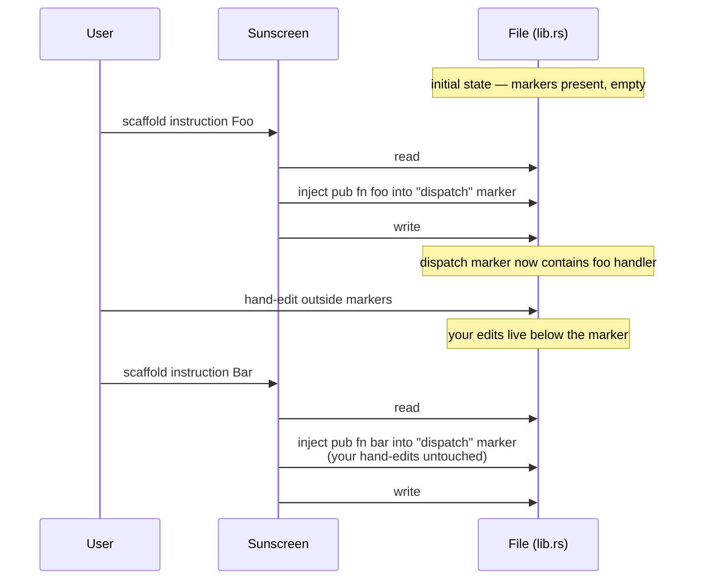

# Incremental scaffolding

The problem: you scaffold a program, then add an instruction six weeks later. You don't want sunscreen to regenerate `lib.rs` from scratch — that would clobber the body you wrote. You also don't want to maintain a hand-edited list of dispatch entries.

The solution: **markers**.

## Lifecycle

## Three guarantees

1. **Idempotency**. Re-running with the same args is a no-op. Sunscreen detects "this symbol already exists in the marker" and exits `4` unless `--force` is passed.
2. **Marker isolation**. Content outside markers is never touched. Content inside markers may be fully regenerated on every run.
3. **Drift detection**. `chain doctor` finds missing or duplicated markers and reports them. `chain doctor --fix-markers` repairs *safe* drift (it refuses to repair sites where reconstruction would be ambiguous).

## Where markers live

Sunscreen places markers in files it scaffolds. As of v0.1.0:

| File | Marker tag |
|------|-----------|
| `programs/*/src/lib.rs` | `dispatch` |
| `programs/*/src/instructions/mod.rs` | `instructions` |
| `programs/*/src/state/mod.rs` | `state` |
| `programs/*/src/events.rs` | `events` |
| `programs/*/src/errors.rs` | `errors` |
| Any error enum inside `errors.rs` | `error_variants` (inside the enum) |

## Why not AST-based?

We tried. `syn`-based patching is brittle when the surrounding code is malformed (e.g. mid-edit, half-typed). Line-based marker editing tolerates anything as long as the marker pair is intact, and merges cleanly with editor undo histories.

The cost: you must keep the markers. `chain doctor` will remind you.

## Read also

- [Marker protocol reference](../reference/markers.md) — exact syntax, generator tags, repair rules.
- [`chain doctor`](../reference/cli/chain.md#doctor) — repair command.
