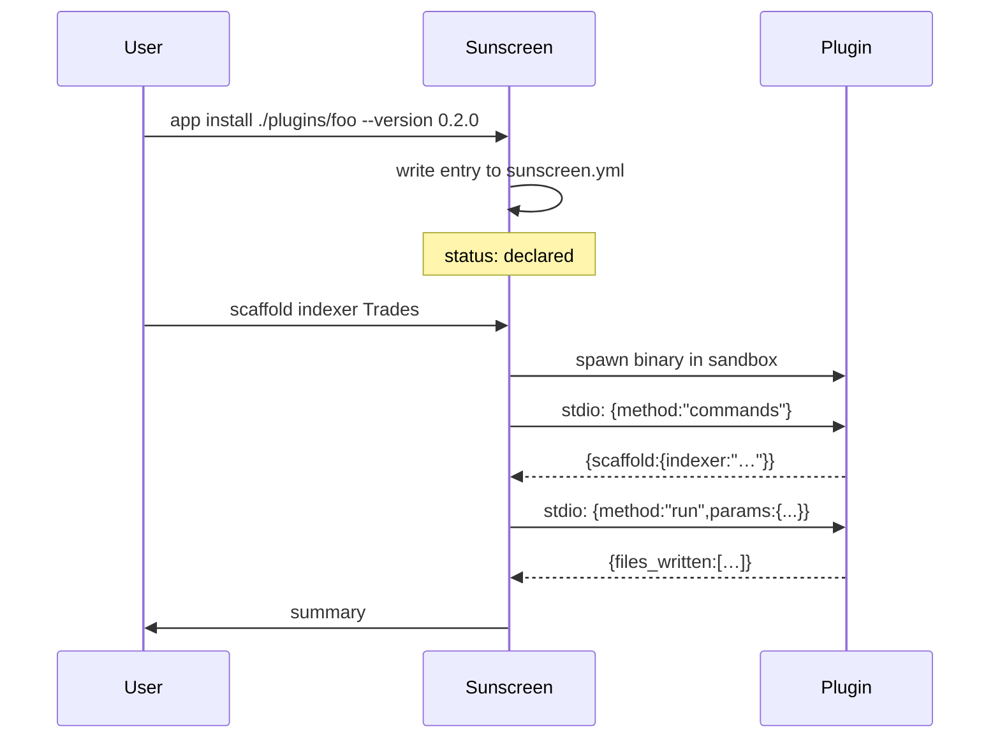

# Plugin runtime

Sunscreen lets you extend the `scaffold <noun>` surface via external binaries. The runtime is intentionally minimal: stdio JSON-RPC, a small set of capabilities, an explicit sandbox.

## Why plugins?

The CLI cannot ship every scaffold the world needs. Teams have internal conventions, third-party libraries have idiomatic shapes, indexer providers have their own templates. Plugins let those live close to where they're maintained, without forking sunscreen.

## Lifecycle



## Trust model

Plugins are arbitrary code. Sunscreen assumes nothing about a plugin's intent and enforces capabilities at the sandbox layer:

| Capability | Default | Opt-in mechanism |
|------------|---------|------------------|
| Read inside workspace | allowed | always on |
| Write inside workspace | denied | `permissions.workspace_write = true` in manifest |
| Read outside workspace | denied | declare each path in `permissions.declared_paths[]` |
| Network | denied | `permissions.network = true` + user approval at install |
| Subprocess spawn | denied | not toggleable in current version |

Violations terminate the session and return exit `9` (`plugin_runtime.sandbox`).

## Discovery

Plugins are not magic. They live in `sunscreen.yml`:

```yaml
plugins:
  - source: ./plugins/foo        # local
    version: "0.2.0"
  - source: github.com/org/bar.git  # remote (download not implemented yet)
    version: "1.0.0"
```

Sunscreen reads this on every command and refreshes its plugin registry.

## JSON-RPC contract

Three methods over line-delimited stdin/stdout:

- `commands` — returns the plugin's command map.
- `run` — invokes a single command with args, flags, and workspace context.
- `hook` — fires a lifecycle hook (`before_build`, `after_build`, …).

See [Plugin protocol reference](../reference/plugin-protocol/index.md) for full schemas.

## gRPC

`proto/plugin.proto` defines a streaming-friendly equivalent. Useful for plugins that need:

- Bidirectional streaming (live progress, log forwarding).
- Non-stdio runtimes (JVM, .NET).

The proto is stable; the gRPC transport is not yet end-to-end live in sunscreen's runtime.

## Reference plugins

[`sunscreen-apps/`](https://github.com/Pantani/sunscreen-apps) contains canonical examples:

- `spl-token-2022` — adds `scaffold spl-token-2022 <Name>` with the 2022-extension features.
- `yellowstone-indexer` — adds `scaffold indexer <Name>` wiring a Yellowstone gRPC consumer.

Read their code to learn the protocol from a working example.

## When *not* to write a plugin

- The scaffold is generic enough to belong in core (open a PR).
- You only need a small variation on an existing recipe — consider a `--flag` instead.
- Your team can just copy-paste a snippet (don't over-engineer).

## See also

- [Plugin protocol reference](../reference/plugin-protocol/index.md) — wire format.
- [`app` command reference](../reference/cli/app.md) — operate on plugins.
- [Working with plugins guide](../guides/plugins.md) — install/run walkthrough.
