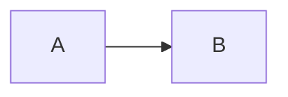

# Documentation style

Rules of thumb for writing pages on this site. Apply them as defaults; break them when the topic actually needs it.

## Tracks have purposes

- **Learn** — teaches concepts to newcomers. Defines every term on first use. Linear reading.
- **Guides** — solves one specific task. Has a tangible artifact at the end. Time-boxed (declare `⏱`).
- **Reference** — catalogs. Optimized for `Ctrl-F`. Tables and lists over prose.
- **Concepts** — explains *why*. The model behind the code. Pairs with reference pages.

Don't blur tracks. If a page is doing two jobs, split it.

## Tone

- **Plain, present, active.** "Sunscreen runs `anchor build`." Not "It is the case that sunscreen will run `anchor build`."
- **Second person for tutorials and guides.** "You'll have a workspace."
- **Third person for reference.** "The command returns exit 4 when…"
- **Honest.** If a feature is partial, say so. If a step might fail, say what to do.

## Length

- Aim for short sentences. Long sentences are usually two short ones in a trenchcoat.
- A Learn page: 200–500 lines, paced with subheads every ~50 lines.
- A Reference page: as long as needed; structure with tables, not prose.
- A Concept page: 100–300 lines with a diagram if it helps.

## Code blocks

Every code block on a Learn or Guide page must run against `main` exactly as written. Pre-commit: run the command yourself, paste the output.

For Reference, code blocks may show the *shape* of input/output without being directly runnable — but call that out (e.g. "request body shape:").

## Diagrams

Use [Mermaid](https://mermaid.js.org/) for diagrams. Embed inline:

```` 

````

Avoid screenshots. Mermaid renders cleanly in dark and light, scales, and stays editable.

## Admonitions

Use sparingly. They draw attention; over-use teaches readers to skip them.

```
```admonish tip
For when there's a non-obvious helpful shortcut.
```
```admonish warning
For when something can damage state or burn money.
```
```admonish danger
For irreversible operations.
``````

## Links

- Link to other docs on first mention of a concept: `[Marker protocol](../reference/markers.md)`.
- Use repo links (`github.com/Pantani/sunscreen/...`) sparingly — they go stale faster than internal links. Prefer internal docs when possible.
- Never link to "click here" — always link the noun.

## Headings

- One `H1` per page (the title).
- `H2` for major sections.
- `H3` sparingly. If you need `H4`, the section probably wants splitting.

## What not to write

- Don't describe the *implementation* of a command — describe the *contract*. Implementation belongs in code comments or ADRs.
- Don't include a "Conclusion" or "Summary" section. The page is the conclusion.
- Don't include a date or version-of-writing in the page body. Versions live in `CHANGELOG.md`; the docs track `main`.
- Don't apologize ("This is a quick guide…"). Just give the content.

## When in doubt

Look at a sibling page in the same track. Match its rhythm.
